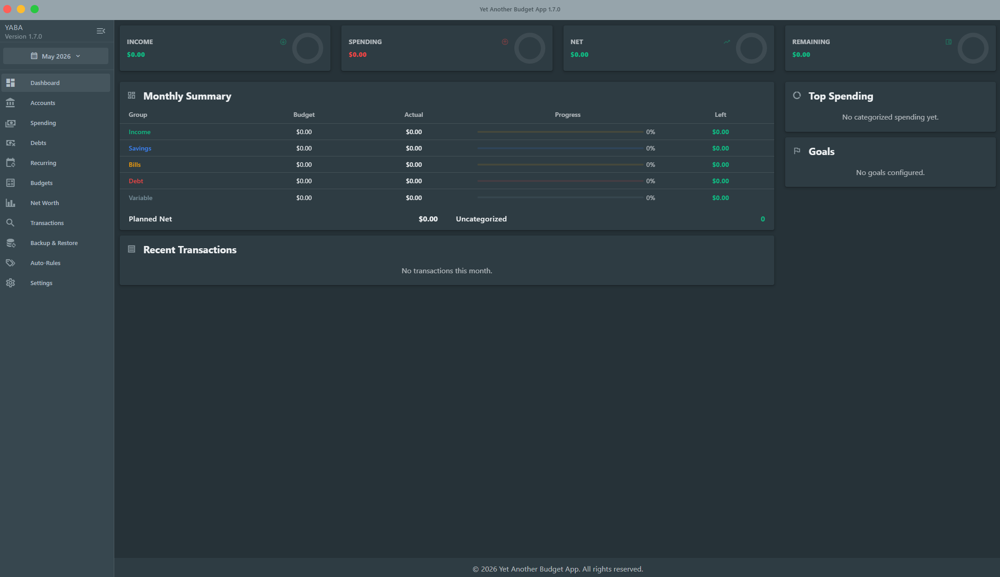

# YABA

Yet Another Budget App is a private desktop budgeting app for tracking accounts, transactions, budgets, debt payoff, savings goals, recurring expenses, and net worth.

YABA is built for people who want to manage their money from bank export files without connecting the app directly to a bank account. Your financial data is stored locally on your computer.

## Download

Download the latest installer from the [GitHub Releases](../../releases) page.

Grab the latest Windows installer (`YABA-1.7.1-setup.exe`), run it, then open YABA from the Start menu or desktop shortcut.

If a release is not available yet, you can build the app from source using the instructions near the bottom of this README.

## Screenshots



## What You Can Do

- Import accounts and transactions from OFX or QFX files exported by your bank.
- Review transactions by month, quarter, or year.
- Search, filter, categorize, split, edit payees, and add notes to transactions.
- Create auto-rules that categorize future transactions by payee, memo, amount, or transaction type.
- Track monthly budgets for income, savings, bills, variable spending, and debt.
- Add due dates to bills and budget categories.
- Track debt payoff using avalanche or snowball strategies.
- Add manual loans such as buy-now-pay-later plans, personal loans, medical debt, and family loans.
- Track savings goals, target amounts, target dates, and progress.
- View dashboard summaries, top spending, recent transactions, net worth, assets, and liabilities.
- Review recurring transactions in a calendar-style view.
- Export encrypted backups and restore them later with a passphrase.
- Export budget data as JSON.
- Choose between Pastel, Blue Grey, and Black & White themes in light or dark mode.

## Getting Started

1. Open YABA.
2. Go to **Accounts**.
3. Click **Add Account**.
4. Choose an `.ofx` or `.qfx` file exported from your bank.
5. Go to **Transactions** to review imported activity.
6. Go to **Budgets** to create categories and monthly plans.
7. Use **Auto-Rules** to speed up categorizing repeated merchants.

You can import new files whenever you download fresh activity from your bank. Duplicate transactions are skipped when the bank provides the same transaction ID.

## Importing Bank Files

YABA supports:

- `.ofx`
- `.qfx`

Most banks provide these from their website under transaction export, download activity, or accounting software export.

YABA does not log in to your bank and does not need your bank password.

## Backups

Use **Backup & Restore** to protect your data.

Encrypted backups require a passphrase of at least 8 characters. Keep this passphrase somewhere safe. If you lose it, the backup cannot be restored.

Restoring a backup overwrites the current app database. After a restore, restart the app so it can load the restored data cleanly.

## Privacy And Storage

**Your data never leaves your computer.** YABA does not transmit, sync, upload, or share any of your financial data with any server, website, cloud service, or third party. There are no accounts to create, no telemetry, no analytics, and no network calls that send your data out. The app runs entirely on your machine.

**Your data is encrypted at rest.** The local database is encrypted with a 256-bit key. On Windows, that key is sealed to your operating-system user account using DPAPI, so another user on the same computer cannot open your database — only the logged-in user who created it can.

**Encrypted backups.** When you export an encrypted backup, YABA protects it with AES-256-GCM using the passphrase you choose. The backup file is yours to store wherever you want; YABA never uploads it.

Important notes:

- The app is designed for fully local, offline use.
- OFX/QFX files are read only from files you select manually on your own disk.
- YABA does not log in to your bank, see your bank credentials, or contact your bank in any way.
- Removing an account from YABA only removes it from the app. It does not affect your bank account.
- Plain JSON exports are _not_ encrypted — handle them like any other sensitive file.

## Main Screens

**Dashboard** gives a monthly overview of income, spending, net cash flow, budget remaining, recent transactions, top spending, and goals.

**Accounts** is where you import bank files, rename accounts, add manual loans, and remove accounts from the app.

**Spending** helps analyze spending patterns by category and merchant.

**Debts** compares avalanche and snowball payoff plans, estimates payoff dates, interest paid, payment snowball growth, and debt-free timing.

**Recurring** shows recurring bills and transactions in a calendar-style view.

**Budgets** lets you plan monthly income, savings, bills, variable spending, and debt payments.

**Net Worth** tracks assets, liabilities, and net worth history.

**Transactions** is the detailed transaction table for search, filtering, categorizing, splitting, notes, bulk edits, and rule creation.

**Auto-Rules** manages transaction rules and custom recurring matches.

**Backup & Restore** handles encrypted backup files and budget JSON exports.

**Settings** controls appearance, themes, and dark mode.

## Requirements

Packaged installers are provided for Windows. macOS and Linux can be built from source (see below) but are not officially supported.

You will also need OFX or QFX transaction files from your bank if you want automatic account and transaction import.

## Project Status

YABA is under active development. Expect new features, UI changes, and occasional rough edges.

Before trying a new version, export an encrypted backup from **Backup & Restore** so you can recover your data if something goes wrong.

## Build From Source

This section is for developers.

Prerequisites:

- Node.js
- pnpm

Install dependencies:

```bash
pnpm install
```

Run in development:

```bash
pnpm dev
```

Build installers:

```bash
pnpm build:win
pnpm build:mac
pnpm build:linux
```

The app is built with Electron, Vue, Vuetify, Pinia, Chart.js, and encrypted SQLite storage.

## Reporting Issues

If you find a bug, open a GitHub issue and include:

- Your operating system
- The app version
- What you were trying to do
- What happened instead
- Whether the issue happened after importing, restoring, or upgrading

Do not attach OFX, QFX, database, backup, or JSON export files unless you have removed all private financial data.

## License

Released under the [MIT License](LICENSE).

## Security

YABA handles sensitive financial data. Please do not post personal financial files, screenshots with account details, or backup passphrases in public issues.

If you discover a security problem, report it privately if the repository has GitHub private vulnerability reporting enabled.
